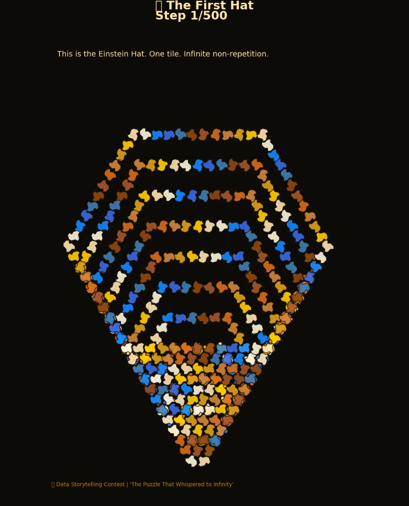
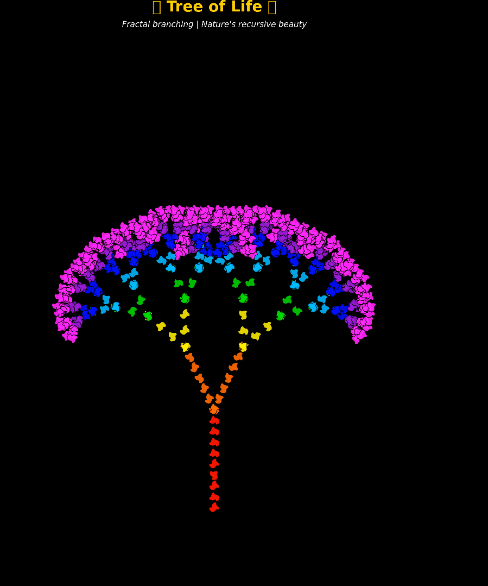
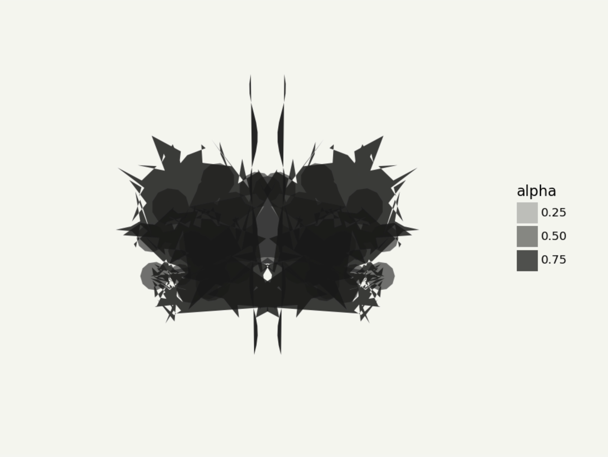
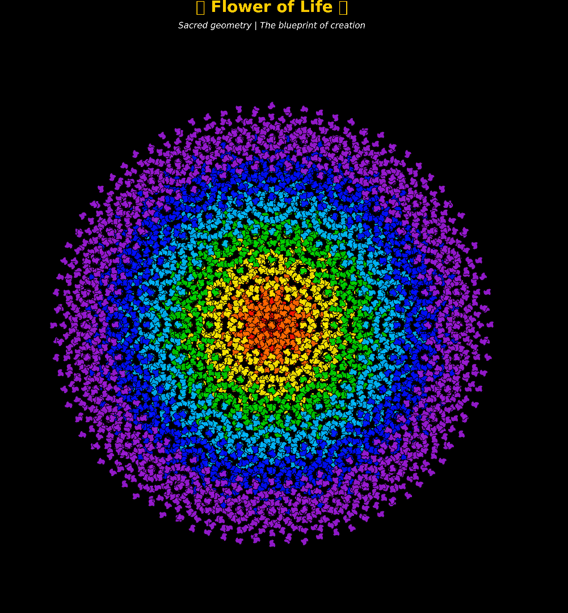
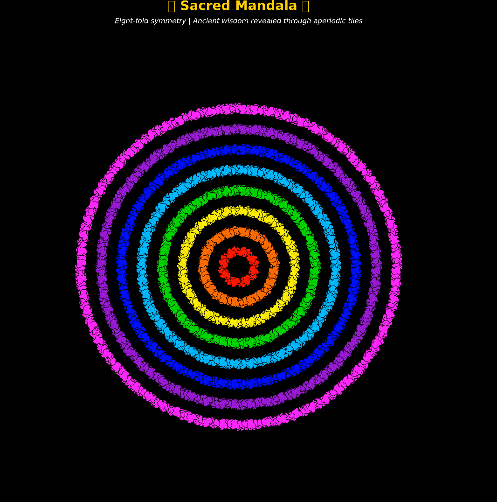
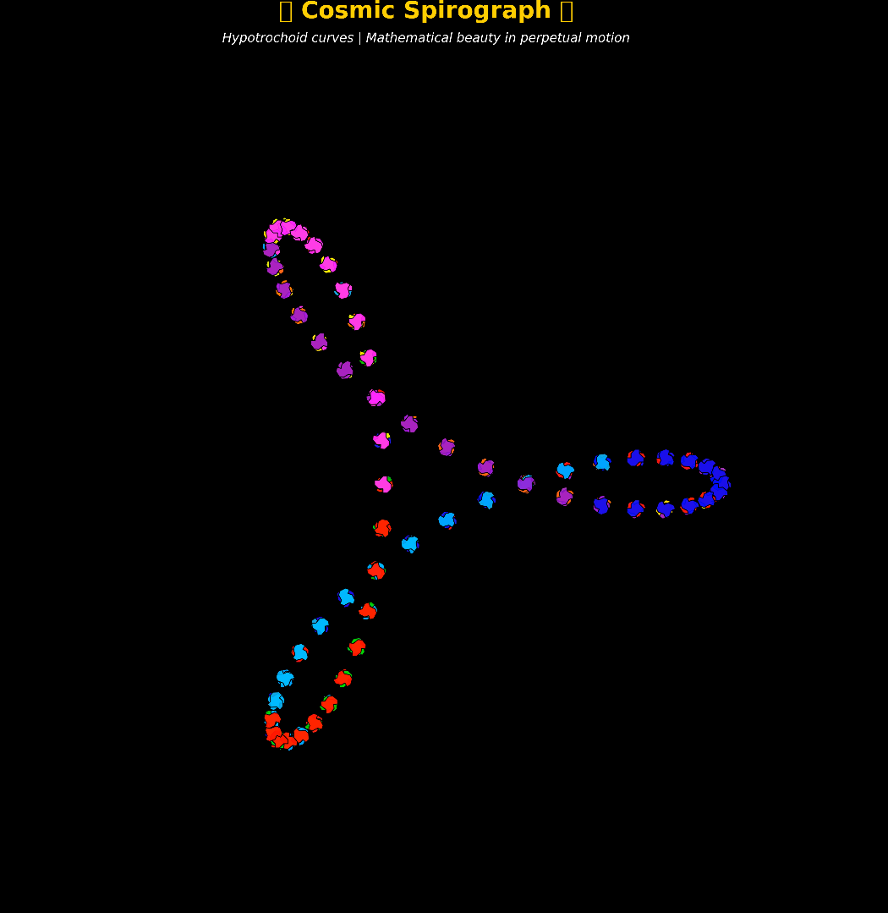
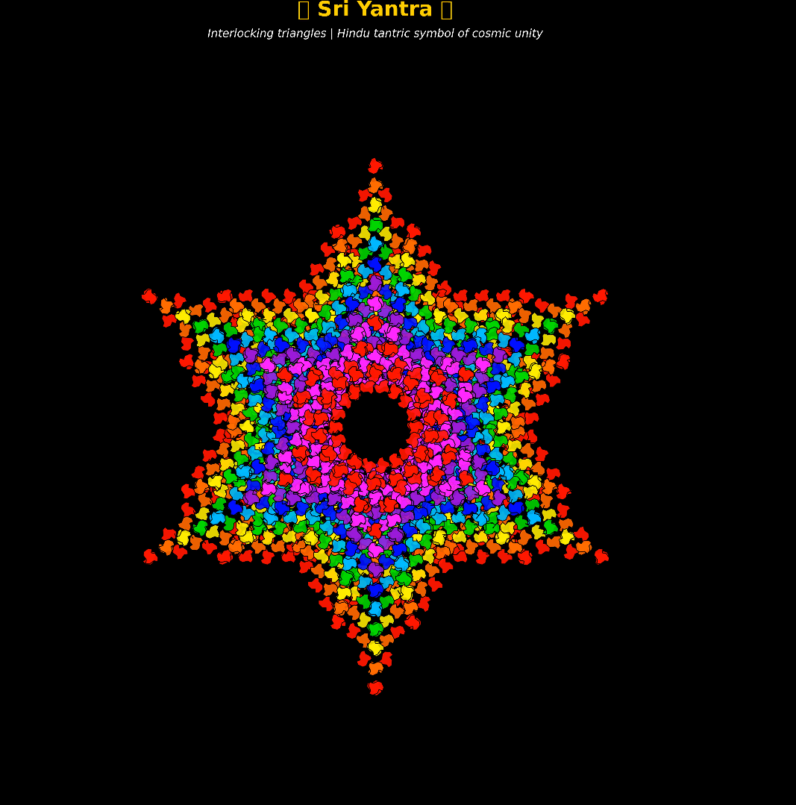

# 🎨2025 Plotnine Contest Submission

Three visualizations exploring the 2023 mathematical discovery of the "Einstein Hat" - a single tile that covers the plane infinitely without ever repeating.

---

## 🖼️ Visualizations Gallery

Here are some images of the animations I created:

|   |   |   |
|---|---|---|
|  |  |  |
| _1. The Einstein Hat Story_ | _2. Kaleidoscopic Tree of life_ | _3. Butterfly Rorschach_ |
|  |  |  |
| _4. Kaleidoscopic Flower of Life_ | _5. Mandala Visualization_ | _6. Spirograph Pattern_ |
|  |   |   |
| _7. Sri Yantra_ |   |   |

---

## 🎬 The Three Visualizations

### 1. 🌱 The Einstein Hat Story
*"The Puzzle That Whispered to Infinity"*

500 tiles emerge one-by-one in a hexagonal spiral, revealing how a single aperiodic shape grows into infinite non-repeating patterns. Five narrative chapters guide the viewer through the mathematical journey.

**Output**: `einstein_hat_story.mp4` (500 frames, 80ms intervals)

<a href="https://github.com/PablaOO7/Plotnine-Contest-2025/blob/master/output_animations/einstein_hat_story.mp4" target="_blank">▶️ Download & Watch Video</a>

---

### 2. 🌳 Kaleidoscopic Tree of Life  
*"Sacred Geometry Meets Aperiodicity"*

Einstein Hat tiles compose a fractal tree structure with recursive branching. Chakra-inspired colors pulse through generations, merging sacred geometry's symmetry with mathematical aperiodicity.

**Output**: `kaleidoscope_fractal_tree_4K.mp4` (42 frames, 4K quality)

<a href="https://github.com/PablaOO7/Plotnine-Contest-2025/blob/master/output_animations/kaleidoscope_fractal_tree_4K.mp4" target="_blank">▶️ Download & Watch Video</a>

---

### 3. 🦋 Butterfly Rorschach
*"Symmetry from Chaos"*

A perfectly symmetric butterfly emerges through simulated ink diffusion on paper. The animation explores the tension between bilateral symmetry and organic randomness, reminiscent of psychological inkblot tests.

**Output**: `butterfly_rorschach.mp4` (120 frames, ink spreading effect)

<a href="https://github.com/PablaOO7/Plotnine-Contest-2025/blob/master/output_animations/butterfly_rorschach.mp4" target="_blank">▶️ Download & Watch Video</a>

---

## 🧩 What is the Einstein Hat?

In March 2023, mathematicians discovered a 13-sided polygon that:

✅ Tiles the entire plane (no gaps, no overlaps)

✅ **Never creates a repeating pattern** (aperiodic)

✅ Requires only one tile shape (monotile)

This solved the decades-old "einstein problem" (*ein stein* = German for "one stone").

**Why it matters**: Previous aperiodic tilings needed multiple tile types (like Penrose tiles). The Einstein Hat does it alone.

---

## 🛠️ Technical Highlights

- **Custom geometry engine**: Rotation matrices, hexagonal spirals, recursive fractals
- **PlotnineAnimation**: Frame-by-frame control with `interval`, `dpi=300`, `bitrate=12000`
- **Data-driven color**: Pre-computed colors/alphas mapped to tile generations
- **Performance**: Vectorized NumPy operations handling 6000+ tiles across 500 frames

### Key plotnine Patterns Used:
```python
(ggplot(aes('x', 'y', group='tile_id', fill='color'))
 + geom_polygon()           # Closed shapes from vertices
 + scale_fill_identity()    # Pre-calculated colors
 + coord_equal()            # Undistorted geometry
 + theme_void())            # Clean mathematical aesthetic
```

---

## 🚀 Quick Start

### Requirements
```bash
pip install plotnine pandas numpy matplotlib
```

### Run the Notebook
Open `2025_Plotnine_Contest.ipynb` and run cells sequentially. Each visualization is independent:

1. **Einstein Hat Story** (~2 min, 500 frames)
2. **Fractal Tree** (~90 sec, 42 frames)  
3. **Butterfly Rorschach** (~60 sec, 120 frames)

---

## 📁 Repository Structure

```
├── 2025_Plotnine_Contest.ipynb             # Main notebook with all three visualizations
├── README.md                               # This file
├── output_animations/                      # Folder for all output files
│   ├── einstein_hat_story.mp4              # Output animation 1
│   ├── kaleidoscope_fractal_tree_4K.mp4    # Output animation 2
│   └── butterfly_rorschach.mp4             # Output animation 3
├── output_images/                          # (Optional) For thumbnails
```

---

## 🎯 Design Philosophy

Each visualization explores a different aspect of the Einstein Hat:

1. **Story**: Narrative emergence - how patterns grow without repeating
2. **Tree**: Structural beauty - aperiodicity meets natural fractals  
3. **Butterfly**: Psychological paradox - forcing symmetry onto chaos

### Aesthetic Choices:
- 🎨 **Color palettes**: Earth tones, chakra spectrum, aged paper
- 🖤 **Dark backgrounds**: Cosmic depth for mathematical meditation
- ⚡ **Animation timing**: Slow enough to observe, fast enough to engage
- 📐 **Square compositions**: Respect geometric integrity

---

## 📚 References

**Mathematical Source**:
- Smith, D., et al. (2023). "An aperiodic monotile". [arXiv:2303.10798](https://arxiv.org/abs/2303.10798)

**Visualization Inspiration**:
- [Dimensionality Reduction Animated](https://github.com/jeroenjanssens/dimensionality-reduction-animated) by Jeroen Janssens
- My [2024 Plotnine Contest Entry](https://github.com/PablaOO7/Plotnine-Contest-2024)

---

## 👤 Author

**Jaspreet Pabla**  
2025 Plotnine Contest Submission

*"In the end, I discovered that infinity doesn't repeat—it evolves."*

---

## 📬 Contact

- GitHub: [\[Your GitHub Profile\]](https://github.com/PablaOO7)
- Contest Discussion: [\[Contest Discussion Page]\(https://github.com/has2k1/plotnine/discussions/999#discussion-9035441)]

---


**License**: MIT (code) | CC-BY-4.0 (visualizations)


